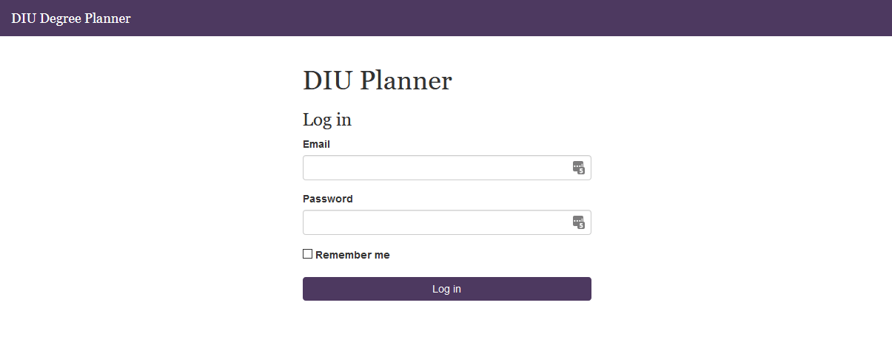
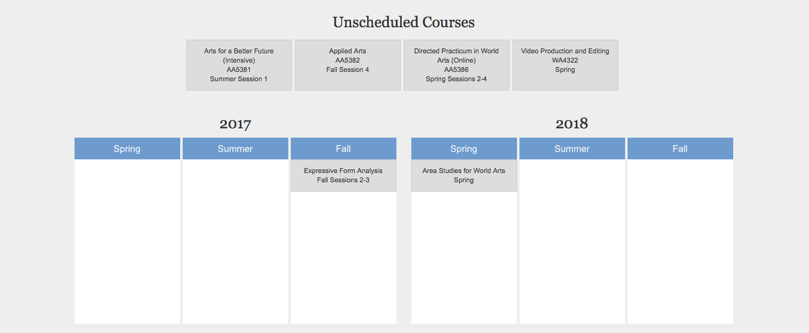
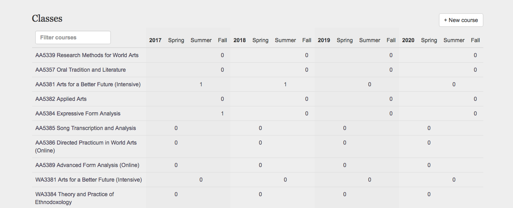
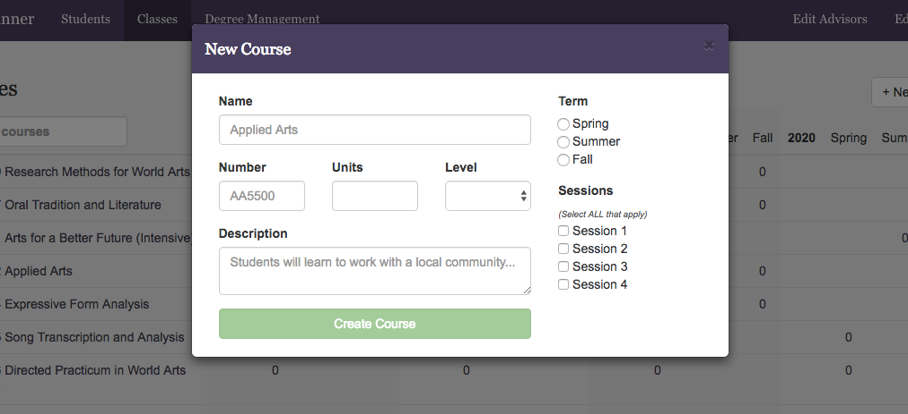
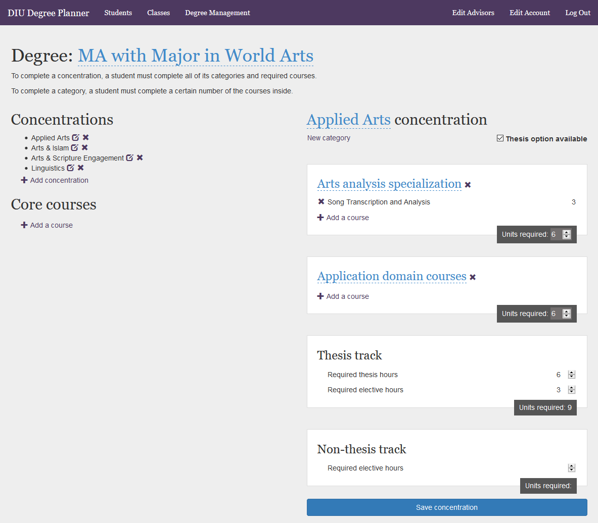

# DIU Degree Planner

by [Alexa Anderson](http://github.com/PopularDemand), [James Harris](http://github.com/DawnPaladin), and [Luke Schleicher](https://github.com/luke-schleicher)

This app helps students at [DIU](http://www.diu.edu) plan which courses to take and provides their advisors with information about their plans. 

**[Try it out!](https://diu-demo.herokuapp.com/)** You can log in with the email address **admin@diu.edu** and the password **adminpass**.

## Background

Students at the [Graduate Institute of Applied Linguistics](http://www.diu.edu) are required to complete an Intended Plan of Study to help them plan which classes to take. This has historically been a labor-intensive process involving lots of spreadsheets; some tasks such as "finding out which students are enrolled in a particular class" are so time-intensive that they're usually left undone, which leads to scheduling problems. This app stores these plans in a relational database, accessed through a purpose-built web client. It dramatically accelerates the process of creating an Intended Plan of Study and instantly provides data that was previously time-prohibitive to collect.

## Walkthrough

### Advisor Log In

### The Student Dashboard

Once logged in, the app takes you to the student dashboard. Students can be sorted by clicking on any column header. Clicking on a student takes you to their graduation planner.

### Building a Student’s Intended Plan of Study

Here the advisor selects a concentration for the student, and chooses from the list of required courses on the right. Boxes turn green as requirements are met. Chosen courses are populated on the left.

### Scheduling Classes

Advisors can drag and drop courses onto a term to schedule them. Available terms are shaded purple while dragging.

### Printing the Student’s Intended Plan of Study

A summary document based on DIU’s existing official documentation, with sections pre-filled based on their previous choices. Advisors select the “print” tab to save or print a PDF of the student’s intended plan of study.

### The Class Dashboard

A comprehensive list of DIU’s classes and the number of students enrolled in each class. Robin was ecstatic about this feature, as it will allow her to make sure her professors aren’t over or underbooked.

### Examining a Class

Clicking on a class brings up a modal with all the class’s information and list of enrolled students. Class details can also be edited here.

### The Degree Dashboard

Here an admin can create a degree from scratch, building a degree’s concentrations, categories within a concentration, and courses within a category. Our goal with this section was to make the app useful to any graduate institution.

### Managing the Advisors

A simple dashboard for an admin to view and update advisor information.

## Architecture

The server is a PostgreSQL database managed by Ruby on Rails running on Heroku. Course data can be seeded into the database through a CSV file or edited through the web interface, which uses AngularJS for its speed of navigation and modular architecture.

This app is intended for use by advisors acting on behalf of students. Advisors meet with students, select classes together, and plan out their degree. The Intended Plan of Study generated by this program can then guide the student as they register for classes.

## Process

The idea for this project came from Robin Harris, head of the World Arts Program at DIU. She was spending an inordinate amount of time managing students' Intended Plans of Study, so when her son (James Harris) asked if she had any ideas for his final project at [Viking Code School](http://www.vikingcodeschool.com), she asked if we could automate IPS creation.

James sat down with her, [mocked up the interface design in Figma](https://www.figma.com/file/S7BLhv0RpwEUCHf7D2kg6f98/DIU-IPS-mockups), and modeled how the database entities would interrelate. He pitched the idea to his cohort at Viking, and Alexa and Luke volunteered to tackle the project.

We (Alexa, Luke, and James) built the app on GitHub over the next two weeks. We parceled out the work during brief daily Scrum meetings, tracking the status of each feature on [Pivotal Tracker](https://www.pivotaltracker.com/projects/1968955). We demonstrated the app to Robin twice during development (making feature adjustments after each demo) and again during Viking's Final Demo day at the end of the project.

## Future

After Demo Day, we'll reset the database to remove test data, change the admin password, and set up accounts for the advisors in DIU's World Arts Program. At that point they can start using the app with real students.

Having reached Minimum Viable Product, we want to continue the app's development to make it more useful to the World Arts Program. In time this may develop into a commercial product which can be licensed to any university!
